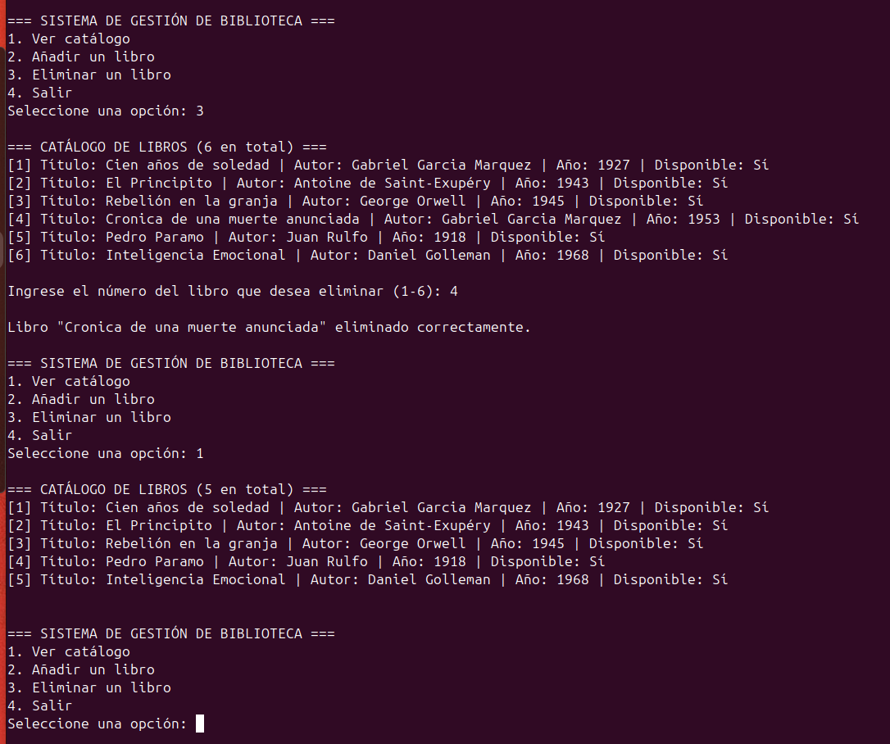
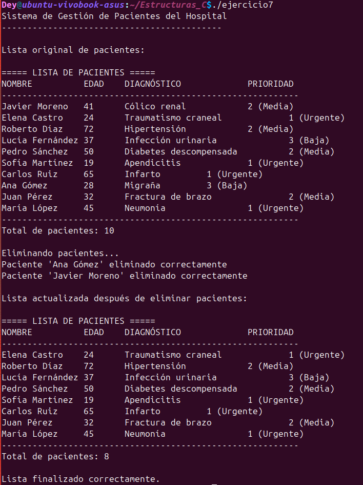

# Estructuras_C
Tarea Esctructuras C
# 📚 Proyecto de Estructuras en C - Ejercicios 1 al 7

## 👩‍💻 Realizado por
**Deisy Hernández Jovita**

---

## 📋 Descripción

Este proyecto contiene los ejercicios del 1 al 7 solicitados, trabajando estructuras, arreglos estáticos y dinámicos en C.  
Se utilizaron buenas prácticas de programación, manejo de memoria dinámica (`malloc`, `realloc`, `free`), uso de apuntadores, y creación de funciones para modularizar el código.

---

## 🚀 Ejecución de los programas

Para compilar y ejecutar los ejercicios principales, sigue estos comandos en tu terminal:

### Ejercicio 6 (Catálogo de Libros)
```bash
gcc ejercicio6.c -o ejercicio6
./ejercicio6
gcc ejercicio7.c -o ejercicio7
./ejercicio7

##📷 Evidencias de Ejecución
### Ejercicio 6 - Gestión de Libros

> Entrada de datos de libros:



---

### Ejercicio 7 - Gestión Dinámica de Empleados en un Departamento

> Ejecución del programa:



🚀 ¡Gracias por visitar este Tarea!
